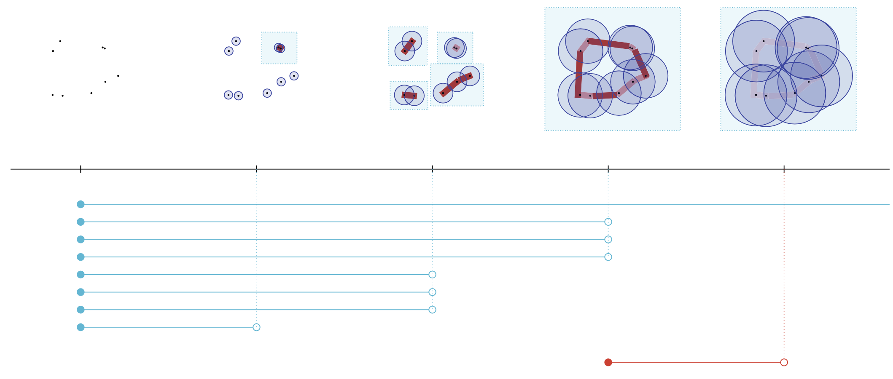
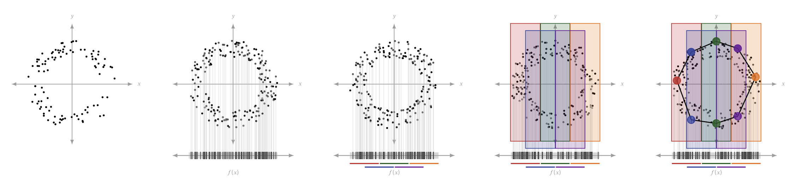
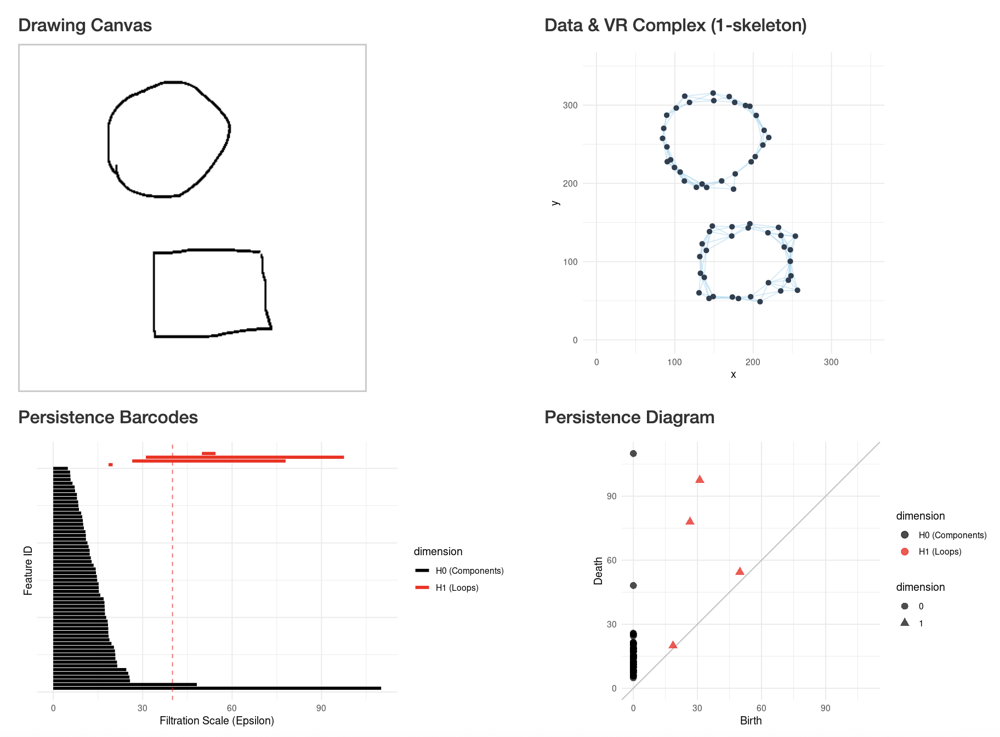
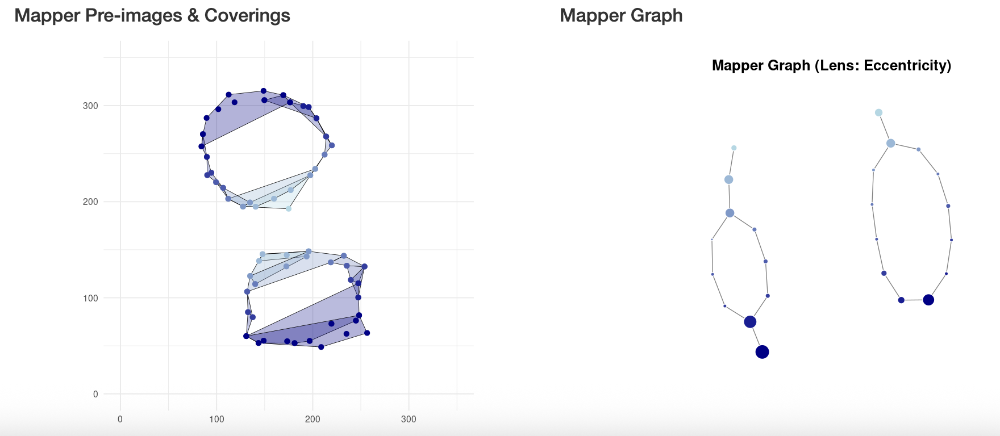

## TopologgeR

[TopologgeR](https://aleliav.shinyapps.io/tda_app/) is an educational Shiny app for exploring two powerful methods in **Topological Data Analysis** (TDA): **persistent homology** and **the Mapper algorithm**. The app was built with the help of the Gemini 2.5 Pro model. Two R packages, `TDA` and `TDAmapper`, were used to implement the methods in the app.

It is not designed for analyzing real multidimensional datasets — several excellent tools have been already published to do that. Instead, the goal of TopologgeR is to make TDA approachable and fun: you draw simple 2D shapes yourself, and the app reveals the topological features hiding within them.

## A brief introduction to TDA

This short and highly informal introduction is intended for the first glimpse into the subject. There are many excellent resources, from basic to technical, that provide a solid overview of TDA methods. Several of them are listed in [Recommended resources](#recommended-resources) below.

Topological Data Analysis extracts topological features ("shapes") from complex, multidimensional datasets. In topology, the shape of an object is defined by its properties that remain unchanged (i.e. invariant) under continuous deformation, such as stretching, bending or twisting. TDA provides a principled framework for identifying and characterizing such structures in data, without knowing whether they exist in advance. TDA is especially powerful when it comes to detection of complex topologies (cycles, trees, etc.) that cannot be projected onto lower dimensions using dimension reduction methods, such as PCA, t-SNE or UMAP.

Two of the most widely used TDA methods are **persistent homology** and the **Mapper**.

### Persistent homology

Persistent homology (PH) analyses a family of graphs (simplicial complexes) built progressively from the data.

The algorithm begins by selecting a distance threshold (a radius of a circle around a point) and computing distances between all pairs of points. Whenever two points are close enough — their circles overlap — they are connected by an edge, forming a graph known as the Vietoris–Rips complex. As the threshold gradually increases, more points become connected and the graph grows denser, until eventually all points are linked together.

By tracking which topological structures appear and disappear as the threshold grows, PH reveals the persistent features of the dataset — those that survive across a wide range of scales. The method excels at detecting loops, lines and clusters (and their higher-dimensional analogues), but it cannot distinguish between more intricate structures such as those with branching.

To better understand the topological terminology (k-skeleton, nerve, Cech complex, VR complex), you can use a little interactive tool, [the Simplicial Complex Explorer](https://leliavski.github.io/pages/simplicial_complex_explorer_v2.html){target="_blank"}

[Image source](https://www.sciencedirect.com/science/article/pii/S1532046422000983)

### The Mapper

The Mapper is a more flexible method capable of detecting structures that PH cannot distinguish. Its power comes at a cost: the Mapper has more parameters to tune, which requires some familiarity with the algorithm. In brief, Mapper works by looking at the data through a specific mathematical "lens" (a filter function), slicing the data into overlapping chunks, and then connecting those chunks to form a graph.

The algorithm proceeds as follows. First, a filter function (the lens) is applied to project the data onto a lower-dimensional space (in the simplest case, onto a single axis). This projection determines how the data will be sliced in the next step. In TopologgeR, you select the filter function explicitly from a list of common options.

Next, the projected range is divided into overlapping intervals (subsets) of a chosen size and overlap ratio (in other words, a cover is constructed). Each data point is assigned to all intervals that contain its projected value, so points in the overlapping regions belong to more than one interval.

Finally, within each interval the data points are clustered into nodes, and any two nodes that share points from an overlapping region are connected by an edge. The result is a graph (a simplicial complex) that summarizes the shape of the data at a coarser level than the original point cloud.

[Image source](https://www.sciencedirect.com/science/article/pii/S1532046422000983)

## How to use TopologgeR

### Input: the drawing canvas

Draw one or more shapes on the canvas. Multiple strokes are supported, so you can create disconnected or composite shapes.

### Parameter setup

The drawn shape is sampled to generate a point cloud for topological analysis. You can control the number of points and the amount of noise added to the data.

For **persistent homology**, adjust the filtration scale ($\epsilon$) to watch how persistence barcodes are generated and how topological features are summarised on the persistence diagram. The Vietoris–Rips complex (1-skeleton) corresponding to a chosen $\epsilon$ value can be visualized directly on the data plot.

For the **Mapper**, the following parameters can be adjusted:

- **Filter function**:
  - *X or Y coordinates*: results in slicing the data linearly along one axis.
  - *Radial distance*: results in slicing the data into concentric rings.
  - *Eccentricity*: measures how far each point lies from the center of the data; particularly useful for detecting branching structures.

- **Number of Intervals (Resolution)**: controls how finely the data are sliced.

- **Percent Overlap**: controls how much consecutive intervals overlap.

### Persistent homology output (upper plots)

- **Data plot with VR complex** (shown as the 1-skeleton)
- **Persistence barcodes**
- **Persistence diagram**

### Mapper output (lower plots)

- **Data plot with pre-images and coverings**
- **Mapper graph**

## Recommended resources

### Videos:

- [Introduction to Persistent Homology](https://www.youtube.com/watch?v=2PSqWBIrn90) by [Matthew Wright](https://www.mlwright.org/). A concise, non-technical overview.

- [An introduction to persistent homology](https://www.youtube.com/watch?v=OkDs9Wj5G1U) by Henry Adams, part of his [Applied Topology course](https://www.youtube.com/playlist?list=PL4kY-dS_mSmLFh9BpI3LqIQnw6KMg0jlt). A more technical yet accessible treatment on the subject.

- [Topological Modeling of Complex Data](https://www.youtube.com/watch?v=8nUBqawu41k) by [Gunnar Carlsson](https://en.wikipedia.org/wiki/Gunnar_Carlsson) — an accessible overview of the Mapper algorithm with many real-world examples.

### Papers:

- [Topological data analysis in biomedicine: A review](https://www.sciencedirect.com/science/article/pii/S1532046422000983) by Y. Skaf and R. Laubenbacher (J Biomed Inform. 2022 Jun;130:104082). A readable summary of TDA for biologists with a list of biomedical applications.

- [Topology and Data](https://www.math.kth.se/math/GRU/2013.2014/SF2704/Papers/Topologyanddata.pdf) by Gunnar Carlsson (*Bulletin of the American Mathematical Society*, 2009, 46(2): 255–308). A formal introduction to TDA and persistent homology. [Presentation slides](https://www.stat.uchicago.edu/~lekheng/meetings/mmds/slides2008/carlsson.pdf) are also available.

- [Notes on the Mapper Algorithm](https://danedmiston.github.io/home_page/assets/Mapper.pdf) by Daniel Edmiston with discussion on parameter selection for the Mapper.

- The original paper on the Mapper: [Topological Methods for the Analysis of High Dimensional Data Sets and 3D Object Recognition](https://research.math.osu.edu/tgda/mapperPBG.pdf) by G. Singh, F. Mémoli, and G.E. Carlsson. (PBG@ Eurographics. 2007 2(091-100), p.90).

------------------
